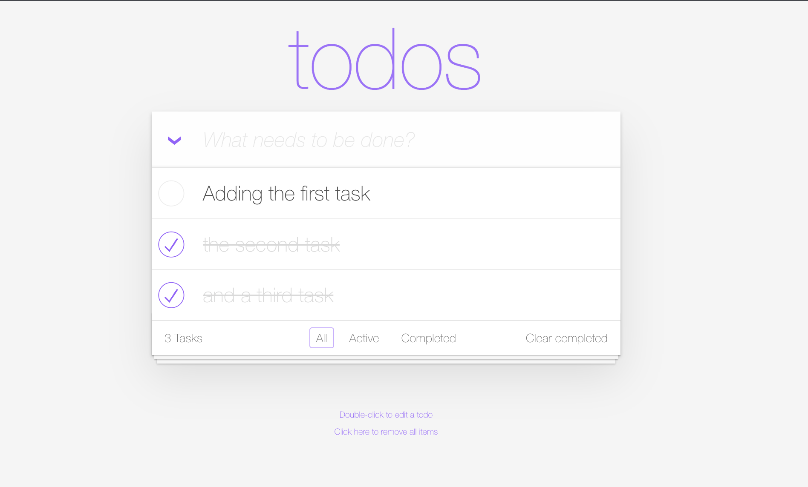

--8<-- "snippets/3-codespaces.js"

## Bug 1: Todo App - Clear completed tasks

Now that you're an expert bug finder from finding bugs in the Bugzapper game, let's look at another app - the Todo App. There are a few bugs in the app that we'll need to investigate.

- Open the Todo app
- Add a few tasks
- Complete some of them by clicking to the left of the task
- Clear the completed tasks

What happens?

***Hints***

- Open up the distributed traces app to make sure API calls work as expected and understand which calls were made to the backend. Press 'ctrl/cmd + K' in Dynatrace and type 'Distributed Tracing' to find the app.
- Open the Live Debugger to set a breakpoint in the the function called when you clear Todos. Press 'ctrl/cmd + K' in Dynatrace and type 'Live Debugger' to find the app. Click the purple pencil icon to set a Live Debugger filter. Use the namespace `todoapp` as your Live Debugger filter.
- Why are the Todo tasks not getting cleared after looking at the code?

## Bug 2: Todo App - Special characters disappearing

Let's add a todo task with some special characters such as exclamation points.

What do you notice? Where is the bug?

***Hints***

- Use the distributed tracing app to filter traces based on the app name, kubernetes namespace, or workload names to see which services are being called. Press 'ctrl/cmd + K' in Dynatrace and type 'Distributed Tracing' to find the app.
- Use the Live Debugger to set a breakpoint in the part of the code you found to analyze the data. Press 'ctrl/cmd + K' in Dynatrace and type 'Live Debugger' to find the app. Click the purple pencil icon to set a Live Debugger filter. Use the namespace `todoapp` as your Live Debugger filter.
- What's happening to the todotitle as it gets added to our list of todos?

- [Cleanup:octicons-arrow-right-24:](cleanup.md)

