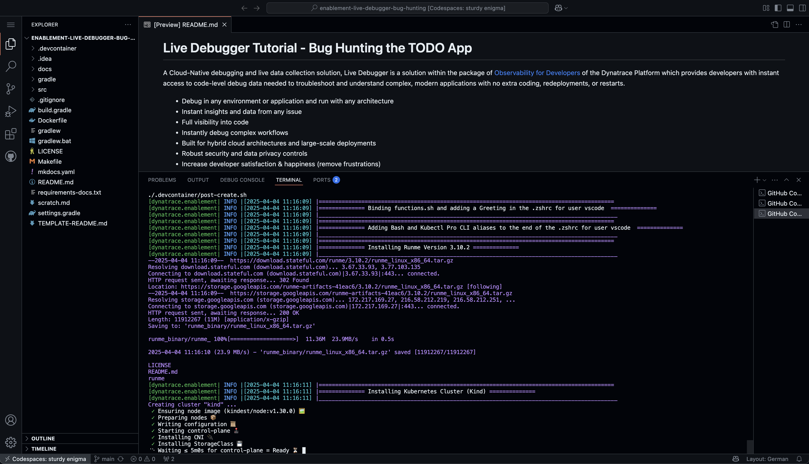

# Codespaces
--8<-- "snippets/codespaces.js"

## 1. Launch Codespace

[](https://github.com/joshDynatrace/bug-busters){target="_blank"}


## 1.1 Codespaces configuration

!!! tip "Branch, Machine sizing & secrets"
    - Branch
        - select the **main** branch
    - Machine sizing
        - As a machine type select **4-core**
    - Secrets (enter your credentials within the following variables)
        - DT_TENANT
        - DT_OPERATOR_TOKEN
        - DT_INGEST_TOKEN


## 2. While the Codespace is set-up for you, learn powerful usecases for Live Debugging
We know your time is very valuable. This codespace takes around 6 minutes to be fully operational. A local Kubernetes ([kind](https://kind.sigs.k8s.io/){target="_blank"}) cluster monitored by Dynatrace will be configured and in it a sample application, the TODO app will be deployed. To make your experience best, we are also installing and configuring tools like:

**k9s kubectl helm node jq python3 gh**

While the Codespace is being set up for you, [here is a 6 minute read about powerful use cases beyond live debugging](https://www.dynatrace.com/news/blog/5-powerful-use-cases-beyond-debugging-for-dynatrace-live-debugger/){target="_blank"}
in our Dynatrace blog.



## 3. Explore what has been deployed

Your Codespace has now deployed the following resources:

- A local Kubernetes ([kind](https://kind.sigs.k8s.io/){target="_blank"}) cluster monitored by Dynatrace, with some pre-deployed apps
  that will be used later in the demo.

- After a couple of minutes, you'll see this screen in your codespaces terminal. It contains the links to the local expose labguide and the UI of the TODO application which we will Live Debug.


## 4. Tips & Tricks

We want to boost your learning and try to make your DEV experience as smooth as possible with Dynatrace trainings. Your Codespaces have a couple of convenience features added. 

### Show the greeting
In the terminal, there are functions loaded for your convenience. By creating a new Terminal the Greeting will be shown that includes the links to the exposed apps, the Github  pages, the Github Repository, the Dynatrace Tenant that is bound to this devcontainer and some of the tools installed.

You can create a new Terminal directly in VSCode, type `zsh` or call the function `printGreeting` and that will print the greeting with the most relevant information.

### Navigating in your local Kubernetes
The client `kubectl` and `k9s`are configured so you can navigate in your local Kubernetes like butter. 


### Exposing the apps to the public
The app TODO app is being exposed from the devcontainer to your localhost or the github dns domain. If you want to make the endpoints public accesible, just go to the ports section in VsCode, right click on them and change the visibility to public.


## 5. Troubleshooting


If there is an issue with the application, we recommend you verify the health of the Kind cluster. 

```bash
kubectl cluster-info
```
The CLI Tool `k9s` is installed in your dev.container, this will help you navigate in your cluster, just type:

```bash
k9s
```

There is a helper function loaded in the shell to see the open ports in the dev.container.
```bash
showOpenPorts(){
  sudo netstat -tulnp
}
```

The todoApp is already exposed via NodePort in the port 30100, if you want to expose it in another port like the one defined 8080 in the service, then type and to expose the TODO app, type `exposeTodoApp`, 
```bash
exposeTodoApp(){
  printInfo "Exposing Todo App in your dev.container"
  nohup kubectl port-forward service/todoapp 8080:8080  -n todoapp --address="0.0.0.0" > /tmp/kubectl-port-forward.log 2>&1 &
}
```
<div class="grid cards" markdown>
- [Back to the main page:octicons-arrow-right-24:](index.md)
</div>