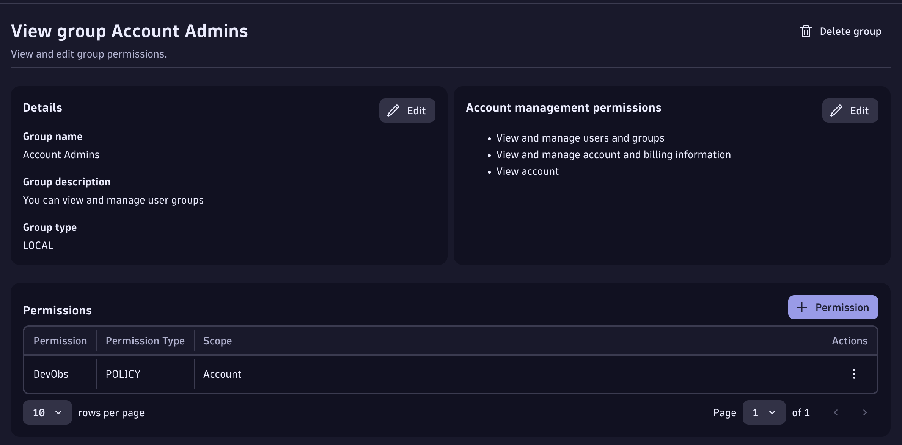

--8<-- "snippets/getting-started.js"
--8<-- "snippets/grail-requirements.md"

## 1. Dynatrace Tenant Setup
You will need a Dynatrace SaaS tenant with a DPS pricing model and the 'Code Monitoring' rate card should be associated with it. In addition the application needs to be monitored with Dynatrace FullStack mode. The application runtime: Java, NodeJS.

### 1.1 Enable Observability for Developers

- Go to Settings > General monitoring settings > OneAgent features.
     - Enable the Java Live-Debugger, Node.js Live-Debugger, or both, depending on your needs.
- Go to Settings > Observability for Developers > Enable Observability for Developers

[More information can be found here](https://docs.dynatrace.com/docs/observe/applications-and-microservices/developer-observability/do-enable)


### 1.2 Set IAM Policies 
We take security very seriously. So let's create a policy to set user-level Live Debugging breakpoints. 

We need two policies for your user to be able to set breakpoints and to read snapshots. 
For this we go to **Account Management > Identity & Access management > + Policy**

Set breakpoints
```bash
ALLOW dev-obs:breakpoints:set;
```
Read Snapshopts
```bash
ALLOW storage:application.snapshots:read;
ALLOW storage:buckets:read WHERE storage:table-name = "application.snapshots";
```

For managing snapshots, setting for Admins.
```bash
ALLOW dev-obs:breakpoints:manage;
```

The policy should look something like this:


[More info here about the IAM Policies here](https://docs.dynatrace.com/docs/observe/applications-and-microservices/developer-observability/offering-capabilities/setup)
Then we bind it to a user group. In this case since we are admins, let's bind the policy to the Admin group. Notice that the created policy is for an Admin and also for a Developer. Since we allow to `read` and `set` breakpoints but also to `manage` breakpoints [which is explained here](https://docs.dynatrace.com/docs/observe/applications-and-microservices/developer-observability/offering-capabilities/additional-settings#manage-breakpoints).

Go to **Group Management > Select Admin Group > + Permission**  (and bind the policy)


Like this you have the fine control to give your developers, SRE teams and whoever you want to set breakpoints and read the snapshots. For more granular access [please continue reading here](https://docs.dynatrace.com/docs/observe/applications-and-microservices/developer-observability/offering-capabilities/setup) 


### 1.3 Enable Live Debugger ActiveGate module

Now we need to enable the [Live Debugger ActiveGate module](https://docs.dynatrace.com/docs/shortlink/do-setup#enable-live-debugging-in-environment-activegate-module):

```yaml
#Set debugging_enabled to true in the custom.properties file.
activeGate:
    customProperties:
      value: |
        [debugging]
        debugging_enabled = true
```
This is already set up for you in the codespaces automatically in the [Dynakube.yaml](https://github.com/dynatrace-wwse/enablement-live-debugger-bug-hunting/blob/main/.devcontainer/yaml/dynakube-skel.yaml) file so no need to restart the ActiveGate.

### 1.4 Enable Log Ingest

You have (2) options:

- Enable built-in log ingest rule to ingest all logs discovered by Dynatrace
- Configure log ingest rule to ingest relevant logs for this lab

In your Dynatrace tenant, open the `Settings` App.  Navigate in the menus to `Collect and capture` > `Log monitoring` > `Log ingest rules`.  This will open the `Settings Classic` App and show you the **Log ingest rules**


**Ingest all logs**

Locate the rule `[Built-in] Ingest all logs` and enable it.  Click `Save changes`.

**Ingest relevant logs**


Click on `Add rule` to create a new Rule.  Configure the Rule:

Rule name:
```text
TODO App Logs
```

Rule type:
```text
Include in storage
```

Conditions:
```text
Kubernetes namespace name = todoapp
```

Click on `Save changes`.

## 2. Create Dynatrace API Tokens for Kubernetes Observability
This codespace has everything automated for you so you can focus on what matters which in this enablement is to learn about the Live Debugging capabilities of the Dynatrace Platform.  You'll need two tokens:

1. Operator Token
2. Ingest Token 

We will get this two very easy from the Kubernetes App. 

### 2.1. Get the Operator Token and the Ingest Token from the Kubernetes App

1. Open the Kubernetes App (CTRL + K then type Kubernetes for fast access)
2. Select the + Add cluster button
3. Scroll down to the section Install Dynatrace Operator 
4. Click on generate Token for the 'Dynatrace Operator' and save it to your Notepad
5. Click on generate Token for the 'Data Ingest Token' and save it to your Notepad
6. You can close the Kubernetes App, we don't need it, we just needed the tokens.


!!! tip "Let's launch the Codespace"
    Now we are ready to launch the Codespace! You'll need your tenant and the two tokens previuosly gathered from above. When you enter the tenant please enter it without the 'apps' part, for production tenants eg. abc123 for live -> https://abc123.live.dynatrace.com and for sprint -> https://abc123.sprint.dynatracelabs.com no apps in the URL.


<div class="grid cards" markdown>
- [Let's launch Codespaces:octicons-arrow-right-24:](codespaces.md)
</div>